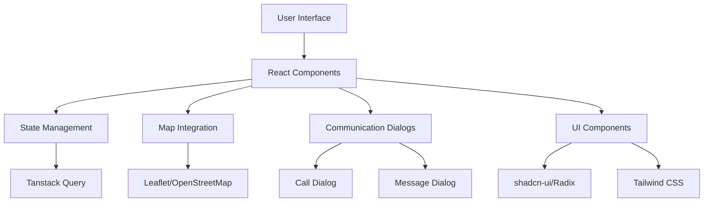

# Home Help Hub Repository Agent

## About This Repository

Home Help Hub is a modern web application for connecting users with home service specialists. It provides an intuitive interface for finding, tracking, and communicating with service professionals.

## Key Features

- **Service Discovery**: Browse and search for home service specialists
- **Interactive Maps**: Location selection and real-time specialist tracking using Leaflet/OpenStreetMap
- **Communication**: In-app calling and messaging with specialists
- **Real-time Updates**: Live ETA and specialist location tracking
- **Responsive Design**: Mobile-first design that works on all devices

## Technology Decisions

### Why Leaflet Instead of Google Maps?
- Free and open-source
- No API key required
- No rate limits or usage costs
- Smaller bundle size
- Works offline with cached tiles

### Component Library: shadcn-ui
- Customizable and accessible
- Built on Radix UI primitives
- Styled with Tailwind CSS
- Fits React/TypeScript ecosystem

### Build Tool: Vite
- Fast development server
- Efficient hot module replacement
- Optimized production builds
- Modern JavaScript support

## Architecture Overview

## Folder Organization

### `/src/components`
Reusable React components:
- `LeafletMapView.tsx` - Interactive map with markers
- `CallDialog.tsx` - Call interface with controls
- `MessageDialog.tsx` - Chat interface
- `AddressInput.tsx` - Location input with map
- `TrackingView.tsx` - Specialist tracking screen

### `/src/pages`
Page-level components and routing

### `/docs`
All project documentation:
- Implementation summaries
- Technical specifications
- Screenshots and visual assets

### `/utils`
Helper utilities and development tools:
- Screenshot automation scripts
- Build helpers
- Test utilities

## Development Workflow

1. **Setup**: `npm install`
2. **Development**: `npm run dev`
3. **Lint**: `npm run lint`
4. **Build**: `npm run build`
5. **Preview**: `npm run preview`

## Agent Responsibilities

When working on this repository, you should:

1. **Maintain Organization**
   - Keep documentation in `/docs`
   - Keep utilities in `/utils`
   - Keep root directory clean

2. **Follow Conventions**
   - Use TypeScript strict mode
   - Follow React best practices
   - Extract magic numbers to constants
   - Use existing design system

3. **Documentation**
   - Update docs when making changes
   - Use Mermaid for architecture diagrams
   - Keep README.md concise
   - Capture UI screenshots

4. **Quality Assurance**
   - Run linter before committing
   - Test changes thoroughly
   - Don't break existing functionality
   - Address security vulnerabilities

## Current Status

The application is feature-complete with:
- ✅ Leaflet map integration
- ✅ Interactive location selection
- ✅ Real-time specialist tracking
- ✅ Synchronized ETA system
- ✅ Call dialog with animations
- ✅ Message dialog with chat
- ✅ Responsive mobile/desktop UI
- ✅ Production-ready code

## Deployment

The application is deployed to Vercel. See README.md for the deployment link.

## Getting Help

- Check `/docs` for detailed technical information
- Review existing components for patterns
- Follow the established code style
- Refer to `rules.md` and `instructions.md` for guidelines
