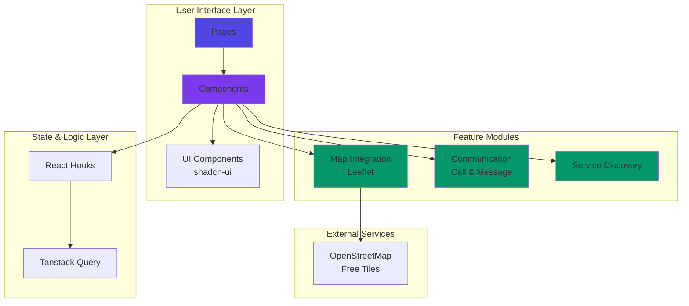
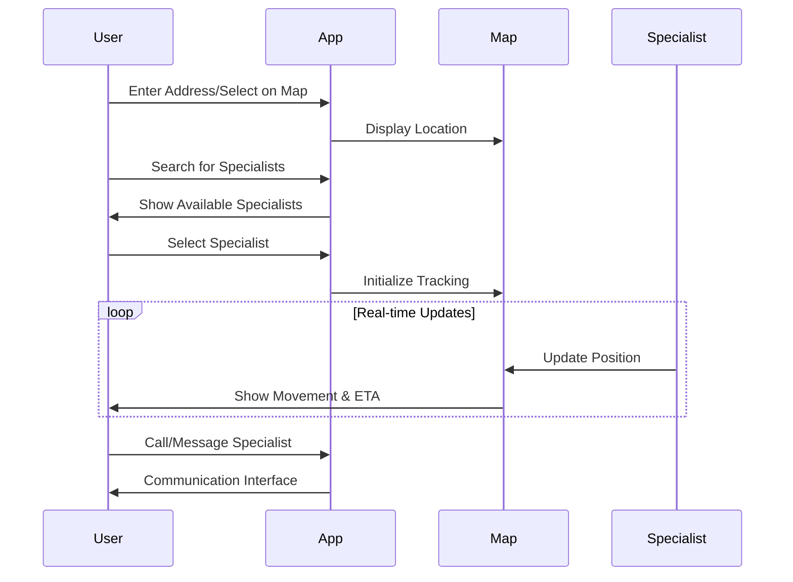

# Home Help Hub

A modern web application connecting users with home service specialists. Find, track, and communicate with service professionals in real-time.

**🚀 Live Demo**: [https://home-help-hub.vercel.app](https://home-help-hub.vercel.app)

## Features

- 🔍 **Service Discovery** - Browse and search for home service specialists
- 🗺️ **Interactive Maps** - Real-time specialist tracking with Leaflet/OpenStreetMap
- 💬 **Communication** - In-app calling and messaging
- 📍 **Location Selection** - Click on map or enter address
- ⏱️ **Live ETA** - Synchronized with specialist movement
- 📱 **Responsive** - Mobile-first design

## Quick Start

```bash
# Install dependencies
npm install

# Start development server
npm run dev

# Build for production
npm run build

# Preview production build
npm run preview

# Run linter
npm run lint
```

## Technology Stack

- **Frontend**: React 18 + TypeScript
- **Build Tool**: Vite
- **UI Components**: shadcn-ui + Radix UI
- **Styling**: Tailwind CSS
- **Maps**: Leaflet + OpenStreetMap (free, no API key required)
- **State Management**: React hooks + Tanstack Query
- **Testing**: Playwright for E2E

## Architecture



## Application Flow



## Project Structure

```
home-help-hub/
├── docs/                    # Documentation (docs-as-code)
│   ├── screenshots/         # UI screenshots
│   ├── FINAL_SUMMARY.md     # Project summary
│   └── IMPLEMENTATION_SUMMARY.md
├── utils/                   # Helper utilities
│   └── take-screenshots.ts  # Playwright automation
├── src/
│   ├── components/          # React components
│   │   ├── LeafletMapView.tsx
│   │   ├── CallDialog.tsx
│   │   └── MessageDialog.tsx
│   ├── pages/               # Page components
│   └── lib/                 # Utility libraries
└── public/                  # Static assets
```

## Key Technical Decisions

### Why Leaflet over Google Maps?
- ✅ Free and open-source
- ✅ No API key required
- ✅ No rate limits or usage costs
- ✅ Smaller bundle size
- ✅ Offline support with cached tiles

### Component Architecture
- Functional components with React hooks
- TypeScript strict mode for type safety
- Reusable UI components from shadcn-ui
- Tailwind CSS for consistent styling

## Development Guidelines

See [/.github/agents/](/.github/agents/) for detailed guidelines:
- `rules.md` - Repository conventions
- `instructions.md` - Agent guidelines
- `repository-agent.md` - Repository overview

Key principles:
- 📚 Documentation in `/docs`
- 🛠️ Utilities in `/utils`
- 🧹 Keep root directory clean
- 🎨 Follow existing design patterns
- 🔒 No secrets in code

## Documentation

Comprehensive documentation available in `/docs`:
- Implementation details
- Technical specifications
- Feature screenshots
- Architecture decisions

## Contributing

1. Follow the project conventions in `/.github/agents/rules.md`
2. Keep changes focused and minimal
3. Update documentation when needed
4. Run linter before committing
5. Test changes thoroughly

## License

[Add your license here]
